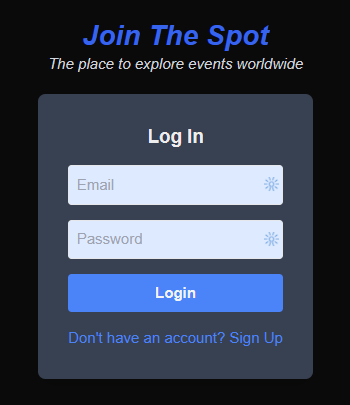
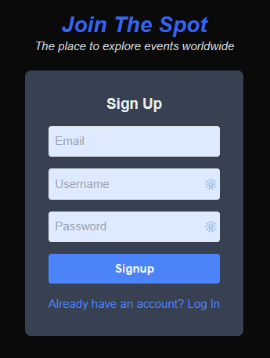

# Multilingual Global Events App

A modern web application built with Next.js for managing and displaying global events with multilingual support.

## Features

- ✅ Multilingual support using next-intl
- ✅ Authentication with JWT
- ⬜ Event management system
- ⬜ Concurrency management
- 🔄 Modern UI made with React
- 🔄 Responsive design with Tailwind CSS
- ✅ TypeScript for type safety
- ✅ Comprehensive testing with Jest, GitHub Actions

### Application Screenshots
#### Home Page
<div align="center" style="display: flex; flex-direction: column; align-items: center;">
  
  <em>Landing Page</em>
</div>

#### Authentication
<div align="center" style="display: flex; justify-content: center; gap: 20px;">
  <div style="display: flex; flex-direction: column; align-items: center;">
    
    <em>Login Page</em>
  </div>
  <div style="display: flex; flex-direction: column; align-items: center;">
    
    <em>Signup Page</em>
  </div>
</div>

## Tech Stack

- **Framework:** Next.js 14 + React
- **Language:** Node.js + TypeScript
- **Styling:** Tailwind CSS
- **Database:** PostgreSQL + Prisma ORM
- **Authentication:** JWT + bcryptjs
- **Testing:** Jest
- **Linting:** ESLint + Prettier

## Project Structure
```
├── .github/            # GitHub configuration files
├── .next/              # Next.js build output
├── messages/           # Internationalization messages
├── node_modules/       # Dependencies
│
├── prisma/             # Database & ORM configuration
│   ├── migrations/        # Database migrations
│   └── schema.prisma      # Database schema
│
├── public/             # Static files: images
│
├── src/                # Source code:
│   ├── app/               # Next.js app directory
│   │   ├── [locale]/         # Internationalized routes
│   │   ├── api/              # API routes
│   │   ├── fonts/            # Font files
│   │   ├── globals.css       # Global styles
│   │   └── layout.tsx        # Root app layout
│   │
│   ├── components/        # React components
│   ├── i18n/              # Internationalization setup
│   ├── lib/               # Utility functions
│   ├── metadata/          # App metadata for SEO
│   ├── config.ts          # environment NODE_ENV configuration
│   └── middleware.ts      # Next.js middleware
│
├── tests/                 # Test files: per routes & files
│
├── LICENSE                # Project license
├── package.json           # Project dependencies and scripts
├── package-lock.json      # Locked dependencies
├── .nvmrc                 # Node version manager config
├── .editorconfig          # Editor configuration
├── .gitignore             # Git ignore rules
├── .gitattributes         # Git attributes
├── .eslintrc.json         # ESLint configuration
├── .prettierrc            # Prettier configuration
├── .prettierignore        # Prettier ignore rules
├── jest.config.mjs        # Jest configuration
├── next-env.d.ts          # Next.js boilerplate TypeScript declarations
├── next.config.mjs        # Next.js configuration
├── postcss.config.mjs     # PostCSS configuration
├── tailwind.config.ts     # Tailwind CSS configuration
└── tsconfig.json          # TypeScript configuration
```


## Prerequisites

- Node.js (version specified in .nvmrc)
- npm
- Git

## Getting Started

1. Clone the repository:
```bash
git clone https://github.com/RamiroHR/multilingual-global-events-app.git
cd multilingual-global-events-app
```

2. Install dependencies:
```bash
npm install
```

3. Set up your environment variables:
Create a `.env` file in the root directory and add necessary environment variables. Check the `.env.example` template.

4. Run the development server:
```bash
npm run dev
```

Open [http://localhost:3000](http://localhost:3000) with your browser to see the application.

## Available Scripts

- `npm run dev` - Start development server
- `npm run build` - Build for production
- `npm run start` - Start production server
- `npm run lint` - Run ESLint with auto-fix
- `npm run format` - Format code with Prettier
- `npm run test` - Run tests (unit & integration)
- `npm run test:coverage` - Run tests with coverage report


## CI/CD Pipeline and Testing

### Pipeline Steps
Our CI/CD pipeline runs automatically on push to `main` and `develop` branches, and on pull requests. The pipeline includes:

1. **Environment Setup**
   - ✅ Node.js 18 setup
   - ✅ PostgreSQL 17 database setup
   - ✅ Environment variables configuration

2. **Code Quality Checks**
   - ✅ Format checking with Prettier
   - ✅ Linting check with ESLint
   - ✅ TypeScript type checking

3. **Testing**
   - ✅ Unit tests execution
   - ✅ Test coverage reporting
   - ✅ Test results artifact upload

4. **Integration**
   - ⬜ Tests complete endpoint flows with real HTTP request 

4. **Deployment**
   - ⬜ Buil Docker image and pucblish in DockerHub
   - ⬜ Deploy to Vercel


### Running Tests Locally

1. Set up test environment variables:
Create a `.env.test` file in the root directory and add necessary environment variables. Check the `.env.test.example` template.

2. Run Tests
   ```bash
   # Run all tests
   npm run test

   # Run tests with coverage
   npm run test:coverage
   ```

### Test Coverage Report

The test coverage report is generated automatically when running `npm run test:coverage`. The report includes:

- Statement coverage
- Branch coverage
- Function coverage
- Line coverage

You can find the coverage report in the `coverage` directory after running the tests. The report is also available to download as an artifact in GitHub Actions after each pipeline run.

Latest test coverage (09/05/2025):
```
-------------------------|---------|----------|---------|---------|-------------------
File                     | % Stmts | % Branch | % Funcs | % Lines | Uncovered Line #s
-------------------------|---------|----------|---------|---------|-------------------
All files                |   91.93 |    84.21 |    87.5 |   94.91 |                  
 src                     |      80 |       50 |     100 |      80 |                  
  config.ts              |      80 |       50 |     100 |      80 | 64               
 src/app/api/auth/login  |     100 |      100 |     100 |     100 |                  
  route.ts               |     100 |      100 |     100 |     100 |                  
 src/app/api/auth/signup |     100 |      100 |     100 |     100 |                  
  route.ts               |     100 |      100 |     100 |     100 |                  
 src/lib                 |    86.2 |       60 |   83.33 |    92.3 |                  
  jwt.ts                 |      75 |        0 |      75 |   85.71 | 29-30            
  prisma.ts              |     100 |      100 |     100 |     100 |                  
  user.ts                |     100 |      100 |     100 |     100 |                  
-------------------------|---------|----------|---------|---------|-------------------

Test Suites: 2 passed, 2 total
Tests:       7 passed, 7 total
Snapshots:   0 total
Time:        4.608 s, estimated 5 s
```

### Local Development Workflow

1. **Before Committing**
   ```
   # Format the code
   npm run format

   # Check linting
   npm run lint:check

   # Run tests
   npm run test:coverage
   ```

## License

This project is licensed under the terms of the license included in the repository.